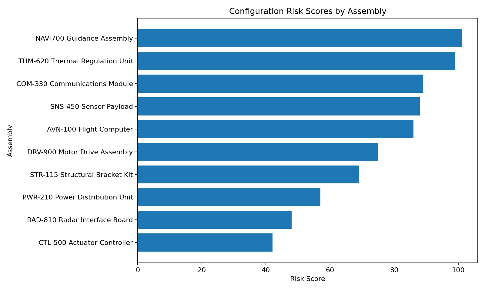
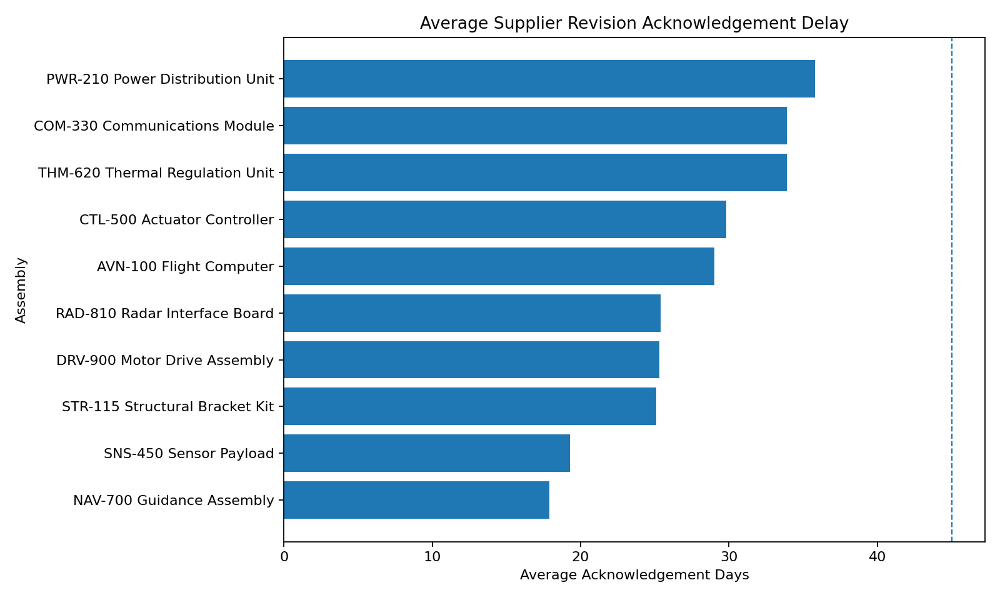
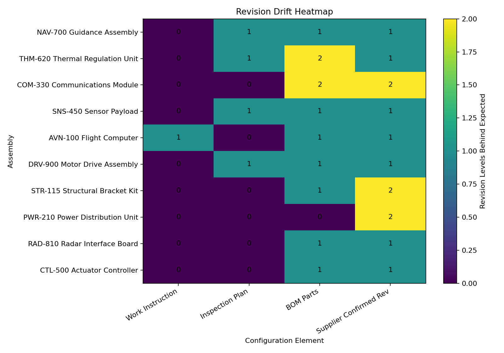
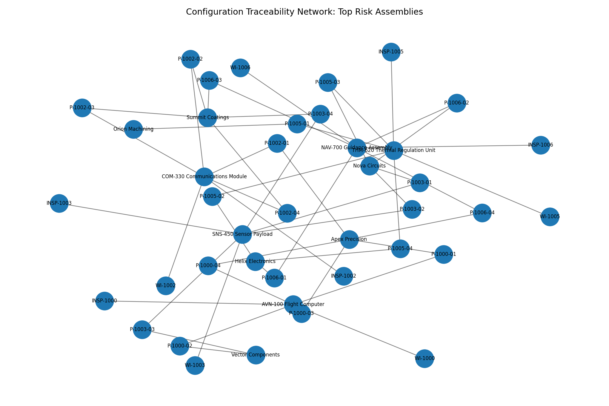

# Manufacturing Configuration Integrity Monitor

AI-assisted revision traceability and configuration risk monitoring for defense manufacturing operations.

## Project Purpose

In regulated manufacturing environments, production risk can come from more than material shortages or equipment downtime. A major hidden risk is **configuration drift**: when engineering revisions, work instructions, inspection plans, supplier records, or BOM components are not aligned to the same approved revision.

This project analyzes synthetic manufacturing configuration data to identify areas where production records may no longer align with the expected engineering baseline. The system checks for outdated work instructions, inspection-plan revision drift, BOM parts that are behind the expected engineering revision, supplier revision lag, obsolete component exposure, single-source part exposure, open quality notes, and pending approval status. By comparing these factors across assemblies, the project identifies which items may be at elevated configuration risk and require additional review before production continues.

The analysis pipeline then produces a scored configuration risk report and a set of generated graphs that help prioritize follow-up actions. These outputs are designed to show how manufacturing, quality, supply chain, and engineering teams could use revision traceability data to detect configuration issues earlier, reduce production risk, and improve audit readiness.

---

## Project Disclaimer

This project uses fully synthetic data created for education and demonstration purposes. No proprietary, classified, export-controlled, or company-specific manufacturing data is used.

The simulated datasets are designed to represent common defense and aerospace manufacturing challenges, including BOM traceability, revision drift, supplier revision lag, work instruction consistency, and configuration risk monitoring.

---

## Why This Project Matters

In aerospace, defense, and advanced manufacturing, production accuracy depends on more than material availability, machine uptime, or schedule execution. It also depends on configuration integrity: making sure every team is working from the correct revision of the product, process, and inspection requirements.

A small revision mismatch can create major downstream issues. A supplier may still be building to an old part revision. A production team may use outdated work instructions. An inspection team may verify against acceptance criteria that no longer match the current engineering configuration. Even if each team is performing its individual task correctly, the overall production system can become misaligned if revision changes are not communicated, adopted, and verified across the full manufacturing workflow.

These issues are often less visible than material shortages or machine downtime, but they can be just as disruptive. Configuration drift can lead to rework, delayed builds, nonconforming hardware, failed inspections, obsolete part usage, supplier confusion, and audit findings. In highly regulated manufacturing environments, these problems can affect not only production efficiency, but also quality control, traceability, compliance, and customer confidence.

Defense manufacturing is especially sensitive to this type of risk because programs often involve complex assemblies, long supplier chains, strict documentation requirements, controlled engineering changes, and high expectations for repeatability. A part, work instruction, BOM, or inspection plan that is only one revision behind can still create risk if it no longer matches the approved engineering baseline.

This project explores how data analytics can be used to monitor configuration integrity across a simulated manufacturing environment. By comparing engineering revisions, BOM records, supplier status, work instruction revisions, and inspection documentation, the system identifies areas where revision drift may create production or quality risk.

The goal is to demonstrate how operational data can support earlier detection of configuration issues before they become larger manufacturing problems. Instead of waiting for a failed inspection, delayed build, or audit finding, teams can use revision traceability and risk scoring to prioritize follow-up actions, improve documentation alignment, and strengthen production readiness.

---

## Generated Visualizations

Running `python src/main.py` creates several PNG visualization outputs in the `outputs/figures/` folder. Each graph is generated from synthetic manufacturing configuration data and is intended to show how revision integrity issues can be identified, communicated, and prioritized in a production environment.

### Configuration Risk Scores

This graph ranks assemblies by their calculated configuration risk score. Higher scores indicate greater exposure to configuration issues such as revision drift, supplier lag, obsolete component exposure, open quality notes, or documentation misalignment.

In this graph, the **NAV-700 Guidance Assembly** and **THM-620 Thermal Regulation Unit** have the highest configuration risk scores, both near or above 100. These assemblies should be reviewed first because they likely have multiple risk factors occurring at the same time. The **COM-330 Communications Module**, **SNS-450 Sensor Payload**, and **AVN-100 Flight Computer** also show elevated risk and should be prioritized after the highest-risk assemblies.

A possible corrective action would be to use this graph as a review priority list. Manufacturing, quality, supply chain, and engineering teams could start with the highest-risk assemblies, confirm whether production should continue, and investigate the specific factors driving each score, such as outdated work instructions, delayed supplier acknowledgement, obsolete parts, or inspection-plan drift.



### Propagation Delay Graph

This graph shows the average number of days it takes suppliers to acknowledge or align with updated revision requirements. Longer acknowledgement delays may indicate a higher risk of supplier revision lag, outdated supplier documentation, or delayed implementation of engineering changes.

In this graph, the **PWR-210 Power Distribution Unit** has the longest average supplier acknowledgement delay, followed by the **COM-330 Communications Module** and **THM-620 Thermal Regulation Unit**. These delays suggest that supplier alignment may be a concern for those assemblies, even if the internal manufacturing documentation is progressing. The dashed reference line helps show that most assemblies remain below the upper delay threshold, but several are still far enough along to justify follow-up.

A possible corrective action would be to contact suppliers associated with the longest-delay assemblies, confirm whether they have received and acknowledged the latest revision, and verify that future deliveries will match the current engineering baseline. Internally, the team could also improve change-notification tracking so supplier acknowledgement is confirmed earlier in the release process.



### Revision Drift Heatmap

This graph shows how far each configuration element is behind the expected engineering revision. The elements include work instructions, inspection plans, BOM parts, and supplier-confirmed revisions. A value of `0` means the record is aligned with the expected revision, while higher values indicate that the record is behind the expected configuration baseline.

In this graph, the largest drift values appear in **BOM Parts** and **Supplier Confirmed Rev**. For example, the **THM-620 Thermal Regulation Unit** and **COM-330 Communications Module** show BOM-related drift of `2`, meaning the BOM part revision is two levels behind the expected engineering revision. The **COM-330 Communications Module**, **STR-115 Structural Bracket Kit**, and **PWR-210 Power Distribution Unit** also show supplier-confirmed revision drift of `2`, which suggests supplier alignment should be reviewed.

A possible corrective action would be to verify the current approved engineering revision for the affected assemblies, update any outdated BOM records, and confirm whether suppliers are producing to the correct revision. Assemblies with drift across multiple elements should be escalated first because they may represent broader configuration-control issues rather than a single documentation update.



### Traceability Network Graph

This graph shows relationships between high-risk assemblies, parts, suppliers, work instructions, and inspection records. It helps visualize how one configuration issue can affect multiple areas of the manufacturing process.

In this graph, several assemblies and suppliers are highly connected, meaning they influence multiple parts of the simulated production system. Assemblies such as the **NAV-700 Guidance Assembly**, **THM-620 Thermal Regulation Unit**, **COM-330 Communications Module**, **SNS-450 Sensor Payload**, and **AVN-100 Flight Computer** appear as central nodes connected to related parts, suppliers, work instructions, and inspection records. A revision issue in one of these connected areas could affect multiple downstream records.

A possible corrective action would be to review the most connected assemblies and suppliers first because they may create the largest downstream impact if their revisions are misaligned. Teams could use this graph to trace which parts, suppliers, work instructions, and inspection records are tied to a high-risk assembly, then verify that each connected record matches the current engineering configuration.



---

## Synthetic Datasets

The datasets simulate a defense manufacturing environment where engineering revisions, BOM records, supplier alignment, work instructions, and inspection documentation must remain synchronized throughout the production lifecycle. The purpose of the synthetic data is to demonstrate how configuration drift and revision misalignment can be detected before they create production delays, quality risks, or audit issues.

### `engineering_revisions.csv`

Contains the expected engineering revision for each assembly, along with the related engineering change notice, release date, criticality level, and change type.

This dataset acts as the source of truth for the simulated manufacturing environment. Other datasets are compared against the expected engineering revision to identify whether suppliers, work instructions, inspection plans, and BOM records are aligned with the current configuration baseline.

Example fields include:

- Assembly ID
- Expected engineering revision
- Engineering change notice
- Release date
- Criticality level
- Change type

### `bom_traceability.csv`

Maps assemblies to their associated parts, part revisions, supplier names, obsolete-part flags, quantity per assembly, and single-source supplier indicators.

This dataset supports BOM traceability analysis by showing which parts belong to each assembly and whether those parts introduce additional production risk. Obsolete parts and single-source components are treated as higher-risk conditions because they may affect availability, replacement options, and production continuity.

Example fields include:

- Assembly ID
- Part ID
- Part revision
- Supplier name
- Quantity per assembly
- Obsolete part flag
- Single-source flag

### `supplier_revision_status.csv`

Tracks whether suppliers have acknowledged and aligned to the expected revision for each part.

This dataset is used to identify supplier revision lag, which occurs when an engineering change has been released but the supplier has not yet confirmed or implemented the updated revision. In a defense manufacturing environment, supplier misalignment can create downstream issues such as incorrect part deliveries, delayed builds, rework, or inspection failures.

Example fields include:

- Supplier name
- Part ID
- Expected revision
- Supplier current revision
- Acknowledgement status
- Days since release
- Alignment status

### `work_instruction_revisions.csv`

Tracks the current work instruction revision used by each manufacturing cell.

This dataset helps determine whether production teams are working from the correct version of the manufacturing instructions. If a work instruction revision does not match the expected engineering revision, the system flags a potential documentation drift issue. This is important because outdated work instructions can result in incorrect build steps, inconsistent assembly methods, or missed process updates.

Example fields include:

- Manufacturing cell
- Assembly ID
- Work instruction ID
- Current work instruction revision
- Expected revision
- Last updated date
- Approval status

### `inspection_revision_log.csv`

Tracks inspection plan revisions, inspection methods, quality notes, and acceptance-criteria alignment.

This dataset supports audit readiness and quality control analysis by comparing inspection documentation against the expected engineering revision. If inspection plans are outdated or acceptance criteria are not aligned, the system identifies the assembly as higher risk because quality teams may be verifying parts against incorrect or outdated requirements.

Example fields include:

- Inspection plan ID
- Assembly ID
- Inspection revision
- Inspection method
- Acceptance-criteria alignment
- Quality notes
- Open issue flag

---

## Project Structure

```text
manufacturing-configuration-integrity-monitor/
│
├── README.md
├── requirements.txt
│
├── app/
│   └── streamlit_app.py
│       # Streamlit dashboard for viewing configuration risk, revision drift,
│       # supplier alignment, audit readiness, and traceability outputs.
│
├── data/
│   ├── engineering_revisions.csv
│   │   # Generated synthetic dataset containing expected engineering revisions,
│   │   # release dates, change notices, criticality levels, and change types.
│   │
│   ├── supplier_revision_status.csv
│   │   # Generated synthetic dataset tracking supplier acknowledgement,
│   │   # supplier current revision, expected revision, and revision alignment.
│   │
│   ├── work_instruction_revisions.csv
│   │   # Generated synthetic dataset showing which work instruction revision
│   │   # is currently being used by each manufacturing cell.
│   │
│   ├── inspection_revision_log.csv
│   │   # Generated synthetic dataset tracking inspection plan revisions,
│   │   # inspection methods, quality notes, and acceptance-criteria alignment.
│   │
│   └── bom_traceability.csv
│       # Generated synthetic dataset mapping assemblies to parts, suppliers,
│       # part revisions, obsolete-part flags, quantities, and single-source indicators.
│
├── outputs/
│   ├── figures/
│   │   ├── revision_drift_heatmap.png
│   │   │   # Generated graph showing revision mismatch severity across
│   │   │   # engineering, supplier, work instruction, inspection, and BOM records.
│   │   │
│   │   ├── propagation_delay_chart.png
│   │   │   # Generated graph showing revision change propagation delays across
│   │   │   # suppliers, manufacturing documentation, and inspection documentation.
│   │   │
│   │   ├── configuration_risk_scores.png
│   │   │   # Generated graph ranking assemblies by calculated configuration risk score.
│   │   │
│   │   └── traceability_network.png
│   │       # Generated graph visualizing relationships between assemblies,
│   │       # suppliers, revisions, work instructions, inspection records, and BOM elements.
│   │
│   └── reports/
│       └── configuration_risk_report.csv
│           # Generated scored report summarizing revision drift, supplier lag,
│           # obsolete part exposure, open quality notes, risk level, and recommended action.
│
├── src/
│   ├── data_generator.py
│   │   # Generates the synthetic manufacturing configuration datasets.
│   │
│   ├── integrity_analysis.py
│   │   # Compares revisions across engineering, BOM, supplier, work instruction,
│   │   # and inspection records to detect configuration drift.
│   │
│   ├── risk_scoring.py
│   │   # Calculates configuration risk scores and assigns risk levels
│   │   # based on drift, supplier lag, obsolete parts, and quality issues.
│   │
│   ├── visualization.py
│   │   # Creates the generated PNG graphs saved in outputs/figures/.
│   │
│   └── main.py
│       # Runs the full project pipeline: data generation, analysis,
│       # risk scoring, report creation, and graph generation.
│
└── docs/
    └── project_overview.md
        # Supporting project documentation explaining the purpose,
        # workflow, assumptions, and defense manufacturing relevance.
```
---